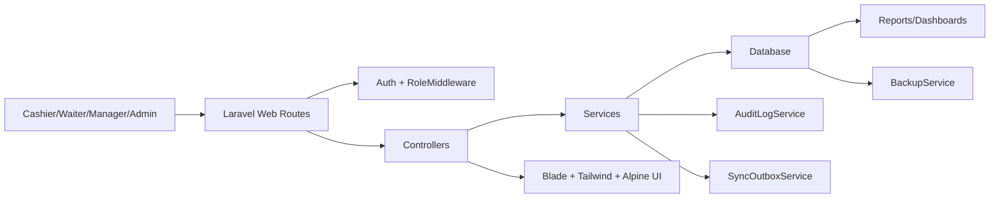
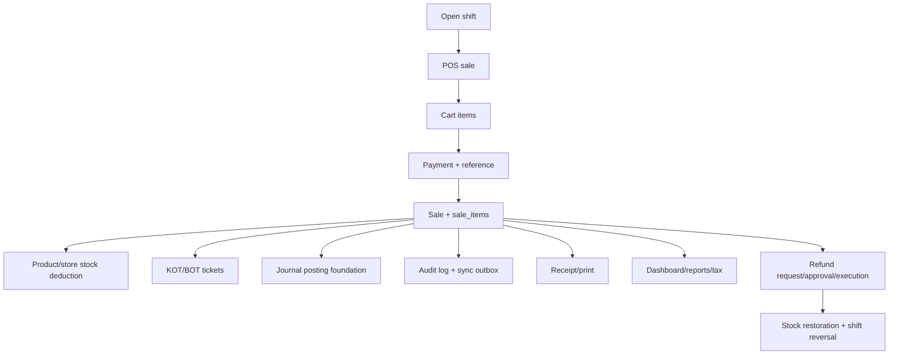
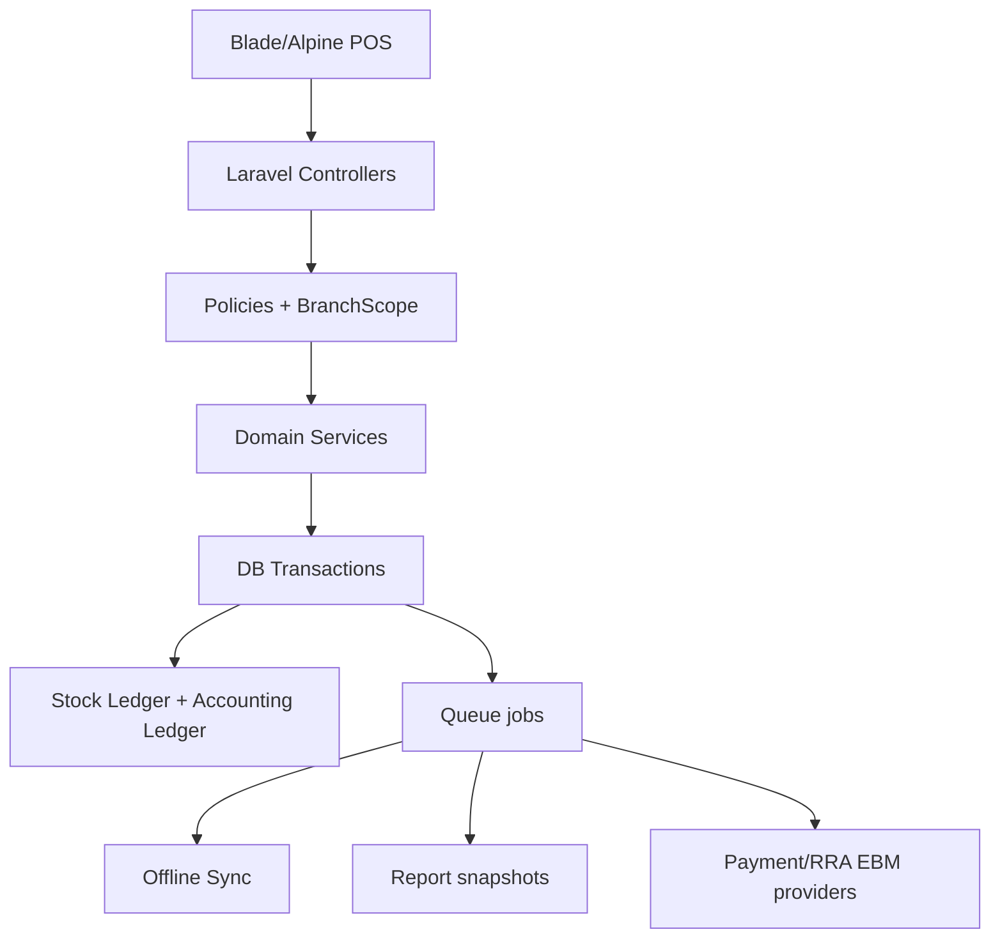

# IKOMEZA POS Ultimate Enterprise Audit

Audit date: 2026-06-15  
Codebase: Laravel 13, PHP 8.5 target, Blade, Tailwind CSS, Alpine.js, SQLite local, PostgreSQL/MySQL intended production.

## 1. Executive Summary

IKOMEZA POS is beyond a prototype for single-branch cashier, stock, shift, refund, audit, and restaurant/bar pilot use. It is not yet enterprise-ready for 100 branches, 2,000 users, or 1,000,000 transactions.

Verdict:

- Single branch: Pilot ready with controls, after Railway/PostgreSQL configuration is fixed.
- Multi-branch: Not ready until all stock, audit, reports, stores, products, customers, and accounting flows are branch-isolated and tested.
- Enterprise: No-go until foreign keys, production database migration, offline sync workers, accounting, RRA EBM integration, reporting warehouse, and operational SOPs are complete.

Immediate fixes applied during this audit:

- POS product cards now collapse duplicated active products before rendering.
- Product create/update now blocks new duplicate POS cards for the same branch, department, category, unit, and price.
- Store stock default-store selection now uses branch and store type before legacy global store codes.
- Audit logs for managers and operational staff are now branch-scoped.
- Regression tests were added for all above issues.

## 2. System Architecture Diagram

Key implementation files:

- Routes: `routes/web.php`, `routes/auth.php`, `routes/console.php`
- POS: `app/Http/Controllers/PosController.php`, `app/Services/SaleService.php`, `resources/views/pos/*`
- Store/inventory: `app/Http/Controllers/StoreManagementController.php`, `app/Services/StoreStockService.php`
- Refunds: `app/Services/RefundWorkflowService.php`, `app/Http/Controllers/RefundController.php`
- Branch/security: `app/Services/BranchAccessService.php`, `app/Services/DepartmentAccessService.php`, `app/Http/Middleware/RoleMiddleware.php`
- Audit: `app/Http/Controllers/AuditLogController.php`, `app/Models/AuditLog.php`, `app/Services/AuditLogService.php`
- Payments: `app/Http/Controllers/PaymentReconciliationController.php`, `app/Services/PaymentReconciliationService.php`
- Backup: `app/Services/BackupService.php`, `resources/views/backups/index.blade.php`

## 3. Business Workflow Diagram

## 4. Database Relationship Map

Core relationship groups:

- Sales: `sales -> sale_items -> products`; `sales -> payments`; `sales -> shifts`; `sales -> customers`; `sales -> restaurant_tables`
- Inventory: `products -> store_stocks`; `products -> stock_movements`; `products -> product_batches`; `stores -> store_stocks`
- Procurement: `suppliers -> purchases -> purchase_items`; `stock_requisitions -> purchases/store_issues`
- Restaurant: `restaurant_tables -> sales`; `sales -> order_tickets -> order_ticket_items`
- Controls: `users -> shifts/sales/audit_logs/payments`; `branches -> users/sales/products/stores/payments/audit_logs`

Critical database issue:

Most local tables show no SQLite foreign keys. Tables reported with no FK enforcement include `sales`, `sale_items`, `payments`, `products`, `stock_movements`, `store_stocks`, `purchases`, `refunds`, `audit_logs`, `users`, and many store-control tables. This is the largest database-readiness blocker.

## 5. Permission Matrix

| Role | POS | Own sales | All reports | Inventory | Purchases | Refund approval | Users/Roles | Audit logs |
|---|---:|---:|---:|---:|---:|---:|---:|---:|
| Cashier | Yes | Yes | No | No | No | No | No | Own sales/shifts |
| Waiter/Server | Yes | Yes | No | No | No | No | No | Own sales/orders |
| Bartender | Limited | Dept | No | Bar | No | No | No | Bar operations |
| Kitchen Chief | No POS route by default | Kitchen | Kitchen | Kitchen | Requisitions | No | No | Kitchen logs |
| Store Keeper | No POS route by default | No | Stock | Assigned store | Receive/issue | No | No | Stock logs |
| Manager | Yes | Branch | Branch ops | Yes | Yes | Yes | Limited users | Branch ops |
| Admin | Yes | All | All | All | All | All | All | All |

Gap:

- Roles mix `users.role`, `roles` table, and Spatie `model_has_roles`. This creates policy drift risk.
- Exact files: `app/Models/User.php`, `app/Services/DefaultRolePermissionService.php`, `routes/web.php`.

## 6. Feature Maturity Matrix

Score: 0 missing, 1 unusable, 2 basic, 3 production-ready, 4 advanced, 5 enterprise.

| Module | Score | Evidence | Main gap |
|---|---:|---|---|
| POS | 3 | Fast cart, payment refs, stock deduction, receipt | Split-bill UI and offline queue not complete |
| Inventory | 3 | Store stock, movements, damages, stock counts | FK integrity, full valuation/aging/dead stock |
| Purchasing | 2 | Purchases, approvals, receiving | Supplier AP ledger not fully operational |
| Suppliers | 2 | Supplier CRUD/report foundation | Performance score/balances not mature |
| Customers | 2 | Customer accounts and credit fields | Credit approval/payment allocation weak |
| Tables | 2 | Tables exist, sale table_id | Transfer/merge/table-map workflow thin |
| Kitchen | 2 | KOT, recipes foundation | Full KDS, prep timing, recipe QA missing |
| Bar | 2 | BOT/department separation | Bartender workflow thin |
| Cash Drawer | 2 | Shift expected cash | Drawer events, cash in/out, lock not complete |
| Refunds | 3 | Request, approval, execution, stock restore | Partial refunds not complete |
| Returns | 2 | Store returns exist | Customer/supplier return accounting weak |
| Reports | 2 | Sales/tax/audit/store reports | BI, scheduled exports, aging, branch rollups missing |
| Audit Logs | 3 | Rich schema, filters, immutable model | Not universal observer coverage |
| Users | 3 | Username login, roles, branch | Permission source consolidation needed |
| Roles/Permissions | 2 | Spatie plus local roles | Mixed authorization model |
| Branches | 2 | branch_id many tables | Not enforced by DB/FKs everywhere |
| Settings | 2 | Business settings | No full admin validation/change approval |
| Backups | 2 | Manual/scheduled command | External storage and restore drills missing |
| Offline Sync | 1 | Inbox/outbox schema | No worker/device UI/conflict resolution UI |
| Accounting | 1 | Journal foundation | Not double-entry complete |
| Tax/RRA | 2 | VAT summary/report | No certified EBM/CIS/SDC integration |

## 7. Workflow Readiness

Restaurant:

- Works for basic POS receipt and KOT/BOT ticket creation.
- Break: table transfer/merge is database-only or thin UI.
- Risk: kitchen item readiness is not enforced before served/paid status.

Bar:

- Works for department-separated products and BOT.
- Break: bartender screen is not a complete high-speed bar order board.
- Risk: stock deduction can be wrong if store branch mapping is not clean.

Supermarket:

- Works for scan/search, receipt, stock deduction.
- Break: no barcode receiving/counting workflow.
- Risk: large product catalog needs server-side pagination/virtualization.

Pharmacy:

- Batch/expiry foundation exists.
- Break: no enforced prescription/regulated-product flow, no FEFO sale UI warning, no expired-stock dashboard.

Wholesale:

- Customer credit foundation exists.
- Break: partial payments and receivables allocation are incomplete.

Workflow readiness score: 56/100.

## 8. Cashier Productivity

Current strengths:

- POS route is compact and mobile card-oriented.
- Product cards support fast tap/add and floating cart.
- Checkout requires non-cash references.

Weaknesses:

- Product list is still rendered as Blade DOM cards, not virtualized.
- Cart checkout still has too many payment fields for high-speed lanes.
- No dedicated keyboard barcode-first mode.
- No hold sale, park sale, recall sale, split tender UX comparable to Square/Toast.

Cashier productivity score: 64/100.

## 9. Inventory Engine Audit

Works:

- Product and store stock are deducted in `app/Services/SaleService.php`.
- Store balances are tracked in `store_stocks`.
- Stock movements exist with before/after quantities.
- Batch/FEFO foundation exists in `app/Services/StoreStockService.php`.
- Stock counts exist in `stock_counts` and `stock_count_items`.

Problems:

- `products.stock` and `store_stocks.quantity` can diverge because they are both live balances.
- Most inventory tables lack DB foreign keys.
- `store_stocks` has no enforced unique constraint visible in local schema for `store_id + product_id`.
- Stock valuation is simple unit cost, not weighted average cost.
- Dead stock, aging, and reorder forecasting are not implemented.

Inventory readiness score: 58/100.

Exact fixes:

- Add canonical FK/index migration for `products`, `stores`, `store_stocks`, `stock_movements`, `product_batches`, `stock_counts`, `stock_damages`, `stock_returns`.
- Make `store_stocks(store_id, product_id)` unique.
- Move valuation to ledger-based weighted-average costing.
- Add reports for expiry, aging, dead stock, stock variance, branch stock valuation.

## 10. Financial Audit

Works:

- `sales`, `payments`, `refunds`, `customer_ledger_entries`, `journal_entries`, `journal_lines` exist.
- Shift totals track payment methods.
- Refund execution reverses shift totals.
- VAT/tax summary is stored in `sales.tax_summary`.

Problems:

- Accounting posting exists as foundation, not a complete audited double-entry engine.
- No locked end-of-day close that prevents backdated edits.
- Payment reconciliation is manual and only in app, not provider-integrated.
- Credit sale approval and receivable aging are not mature.
- No RRA EBM certification/integration.

Accounting readiness score: 42/100.

Exact files:

- `app/Services/AccountingService.php`
- `app/Services/SaleService.php`
- `app/Services/RefundWorkflowService.php`
- `app/Http/Controllers/PaymentReconciliationController.php`
- `resources/views/payments/reconciliation.blade.php`

## 11. Fraud Resistance Audit

Resistance improved:

- Refunds have request/approval workflow.
- Audit logs are immutable at model level.
- Discounts require reason and role limit.
- Non-cash payment references are required.
- Shift totals reverse on refund.

Remaining fraud paths:

- Admin can still approve own refund by design; acceptable for owner, risky for delegated admins.
- Category, role, permission delete routes still exist.
- Audit coverage is not universal for every model action.
- Backdated sale/purchase prevention is not enforced.
- No cash drawer open/close event trail.
- No manager approval queue for credit sale above limit.

Fraud resistance score: 61/100.

## 12. Security Audit

Strengths:

- Laravel CSRF/session/auth are used.
- Username login exists.
- Route middleware covers most modules.
- `AuditLog` blocks normal update/delete.
- Production preflight blocks unsafe SQLite/local DB and demo seeders.

Weaknesses:

- No rate limiting on login observed in route list.
- Mixed role sources create privilege drift.
- No policy classes for core models.
- No 2FA or password rotation policy.
- Manager audit visibility was branch-leaky before this audit and was patched.
- Export endpoints need stricter branch and volume controls for large deployments.

Security score: 66/100.

## 13. Database Audit

Critical findings:

- Local schema shows most business tables have no FK constraints.
- Migrations contain SQLite-only rebuilds and `PRAGMA` statements.
- Multiple patch migrations use `Schema::hasColumn`, which is safe for legacy data but leaves schema history messy.
- `stores.code` is globally unique, which conflicts with natural multi-branch code names like `BAR`.
- Many enum/status values are strings without DB constraints.
- `products.stock` duplicates store stock state.

Database score: 49/100.

Exact tables to modify:

- `products`, `categories`, `stores`, `store_stocks`, `sales`, `sale_items`, `payments`, `refunds`, `refund_requests`, `shifts`, `stock_movements`, `stock_counts`, `stock_count_items`, `purchases`, `purchase_items`, `suppliers`, `audit_logs`, `restaurant_tables`, `order_tickets`, `order_ticket_items`, `users`, `branches`.

## 14. UI/UX Audit

Strengths:

- POS product cards are compact and mobile-oriented.
- Mobile bottom navigation exists.
- Dashboard is role-aware.
- Reports/print screens improved compared to early card-heavy pages.

Weaknesses:

- Many admin/store screens still use dense tables without mobile card alternatives.
- Product cards were duplicated when DB rows duplicated; fixed during this audit.
- Some long reports still rely on HTML/PDF manual rendering.
- Forms like product create/edit are still large on phone.

UI/UX score: 65/100.

## 15. Reporting Audit

Existing:

- Sales, tax, audit, store dashboard, shifts, inventory, payment reconciliation.

Missing or weak:

- Branch consolidated report.
- Dead stock report.
- Inventory aging report.
- Supplier performance.
- Customer receivables aging.
- Cash drawer event report.
- End-of-day locked close report.
- Scheduled email/export reports.
- BI-grade large dataset report service.

Reporting score: 52/100.

## 16. Scalability Audit

What fails first at scale:

1. SQLite/local DB or misconfigured Railway DB: immediate production failure.
2. Blade-rendered POS product grid with thousands of products: slow DOM and memory.
3. Reports using repeated cloned aggregate queries: slow at 1,000,000 transactions.
4. Missing DB foreign keys and unique constraints: data drift.
5. Synchronous checkout with stock, tickets, accounting, audit, and sync outbox in one request: latency under load.
6. No queue workers for sync, notifications, exports, and reports.

Scalability score: 41/100.

## 17. Competitive Comparison

| System | IKOMEZA position |
|---|---|
| Loyverse | Worse polish/offline maturity; better local customization potential |
| Square POS | Worse ecosystem/payment/device maturity; better Rwanda-specific control potential |
| Toast POS | Worse restaurant/table/KDS maturity; has basic KOT/BOT foundation |
| Lightspeed | Worse inventory/reporting maturity; simpler to customize |
| Aronium | Comparable simple retail direction; weaker Windows/offline maturity |
| Odoo POS | Worse ERP/accounting breadth; simpler targeted POS workflow |

## 18. Code Quality Audit

Strengths:

- Services exist for sale, refund, store stock, audit, tax, backup, sync.
- Checkout/refund use transactions.
- Tests exist and are growing.

Weaknesses:

- Controllers remain large and carry business logic.
- Authorization is route-string based, not policy-based.
- Some services use `Schema::hasColumn` runtime compatibility paths.
- Several migrations are historical patch/rebuild migrations, not clean canonical schema.
- Reports contain heavy query logic in controllers.

Code quality score: 58/100.

## 19. Critical Problems

1. No production database attached on Railway caused `127.0.0.1:5432` crash. Fix variables/database service.
2. Missing DB foreign keys across core business tables.
3. Accounting is not complete double-entry.
4. RRA EBM/CIS/SDC integration not implemented.
5. Offline sync has schema only, no full engine.
6. `stores.code` globally unique blocks natural per-branch store codes.
7. POS product grid not virtualized for large catalogs.
8. Reports not optimized for million-transaction datasets.
9. Full branch isolation is partly code-level, not DB-level.
10. Backdated transaction/close-day lock incomplete.

## 20. High Priority Problems

1. Complete canonical PostgreSQL migration and staging run.
2. Add policies for Sale, Product, Store, Payment, Refund, AuditLog, Purchase.
3. Add unique constraints: `store_stocks(store_id, product_id)`, `products(branch_id, barcode)`, `payments(idempotency_key)`, `restaurant_tables(branch_id, table_code)`.
4. Convert `stores.code` unique to `stores(branch_id, code)` unique.
5. Add provider import for payment reconciliation.
6. Add stock valuation ledger.
7. Add partial refund workflow.
8. Add receivables aging report.
9. Add cash drawer events.
10. Add login throttling/2FA option.

## 21. Recommended Architecture

Recommended service split:

- `CheckoutService`
- `PaymentAllocationService`
- `StockLedgerService`
- `AccountingPostingService`
- `FiscalReceiptService`
- `BranchScope`
- `ReportQueryService`
- `OfflineSyncProcessor`

## 22. Exact Files To Modify Next

- `database/migrations/*`: create canonical FK/index migration.
- `app/Services/SaleService.php`: extract payment, stock, accounting, ticket responsibilities.
- `app/Services/StoreStockService.php`: complete weighted average costing and branch/store uniqueness assumptions.
- `app/Services/AccountingService.php`: complete double-entry rules.
- `app/Http/Controllers/ReportController.php`: move report logic into service and optimize aggregates.
- `app/Http/Controllers/AuditLogController.php`: enforce branch filters in all exports and add export jobs.
- `app/Models/User.php`: remove role-source ambiguity.
- `routes/web.php`: replace large role strings with policies/permissions.
- `resources/views/pos/index.blade.php`: virtualized/paginated product data source.
- `resources/views/store/*.blade.php`: mobile card alternatives and scan workflows.

## 23. Exact Tables To Modify Next

- `stores`: replace global code unique with branch-aware code unique.
- `store_stocks`: add unique store/product; enforce FK store/product/branch/department.
- `products`: add branch-aware barcode/product_code uniqueness.
- `sales`: enforce FK user/shift/branch/customer/table.
- `sale_items`: enforce FK sale/product/department.
- `payments`: enforce FK sale/shift/customer/branch/reconciled_by; unique idempotency.
- `stock_movements`: enforce product/store/branch/user FKs.
- `audit_logs`: enforce user/branch/department nullable FKs and append-only database trigger if PostgreSQL.
- `journal_entries`, `journal_lines`: enforce balanced entries.
- `product_batches`: enforce non-negative quantity and expiry indexes.

## 24. Estimated Development Effort

- DB canonicalization and PostgreSQL staging: 4 to 7 days.
- Policies/branch isolation complete: 3 to 5 days.
- Accounting ledger maturity: 10 to 20 days.
- RRA EBM integration readiness with a vendor: 15 to 30 days, depending on provider.
- Offline sync engine: 20 to 45 days.
- Enterprise reporting/BI: 10 to 20 days.
- Mobile UX completion for all admin/store pages: 7 to 14 days.

## 25. Scorecard

- Product readiness: 60/100
- Business workflow readiness: 56/100
- Inventory readiness: 58/100
- Accounting readiness: 42/100
- Fraud resistance: 61/100
- Security: 66/100
- Database: 49/100
- UI/UX: 65/100
- Reporting: 52/100
- Scalability: 41/100
- Code quality: 58/100

Overall readiness score: 56/100.

## 26. Verdict

Single branch verdict: Pilot only, with PostgreSQL configured and backup tested.

Multi-branch verdict: No-go until database constraints, store code uniqueness, policy-based branch isolation, and branch report tests are complete.

Enterprise verdict: Not enterprise ready.

GO/NO-GO recommendation:

- GO for controlled single-branch pilot with trained users, backups, and manual reconciliation.
- NO-GO for multi-branch commercial rollout.
- NO-GO for investor/enterprise claims against Odoo, Toast, Lightspeed, or Square until accounting, offline sync, RRA fiscalization, and reporting mature.

